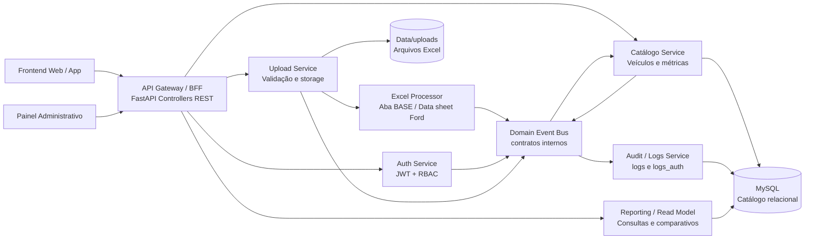

# MEMBROS
- Douglas dos Santos Melo RM556439 
- Henrique Sanches RM557959
- João Pedro Kraide Máximo RM563166
- Matheus Marcelino Dantas da Silva RM556332
- Nicolas Caciolato reis RM556506

# Projeto Base - Sistema Veículos (SOA + Cyber)
Aplicação web e API em Python (FastAPI) com:
- cadastro/login de usuários
- autenticação JWT com payload em Base64
- cadastro e consulta de veículos
- upload simples de Excel
- processamento estruturado de Excel para alimentar catálogo
- logs/auditoria conforme schema relacional solicitado

## Diagrama arquitetural



## Schema de banco (atual)

Tabelas implementadas no codigo:
- `users`
- `marcas`
- `modelos`
- `versoes`
- `veículos`
- `metricas_veiculos`
- `logs`
- `logs_auth`
- `password_reset_tokens`

Importante:
- A aplicação **não recria tabelas automaticamente** no startup.
- O script SQL do schema fica em `app/db/schema.sql`.
- Para criar/recriar o banco MySQL `veículos_db`, execute `py -3 -m app.db.init_db`.

## Autenticação

Fluxo:
1. Cadastro cria usuario em `users`.
2. Senha e armazenada com hash de `email_normalizado + ":" + senha`.
3. Login valida esse hash.
4. JWT inclui `sub`, `role`, `cred_fingerprint`, `dados_base64`, `iat`, `exp`.
5. RBAC valida assinatura, expiracao, integridade do Base64 e fingerprint atual da credencial.
6. Tentativas de autenticacao sao registradas em `logs_auth` (sucesso/falha).

## veículos e métricas

Cadastro (`POST /api/v1/veículos`) grava:
- `marcas` (se não existir)
- `modelos` (se não existir para a marca)
- `versoes` (se não existir)
- `veiculos`
- `metricas_veiculos`

Consulta (`POST /api/v1/veículos/comparar`) busca por `marca/modelo/versao` e retorna dados tecnicos + metrica mais recente.

Observacao de contrato:
- `metricas_veiculos.preco_sugerido` permite `NULL` para cenarios de importacao com preco pendente.

## Upload Excel

### Upload simples

Endpoint: `POST /api/v1/uploads/excel`

Regras:
- exige Bearer token
- aceita apenas `.xlsx` e `.xls`
- valida MIME e tamanho
- salva arquivo em `UPLOAD_DIR`
- registra sempre um evento em `logs` com ação `ENVIO_INFORMACOES_EXCEL`
- quando ainda não existe métrica vinculada, `logs.metrica_veiculo_id` fica `NULL`

### Processamento estruturado (catálogo)

Endpoint: `POST /api/v1/uploads/excel/processar`

Regras:
- exige Bearer token com perfil `admin` ou `analista`
- aceita apenas `.xlsx` para parse estruturado
- exige aba `BASE` com primeira coluna `Equipamentos`
- trata cada coluna de versão como uma configuração de veículo do mesmo modelo
- executa `upsert` em `marcas -> modelos -> versoes -> veículos`
- cria sempre nova linha histórica em `metricas_veiculos` (sem sobrescrever snapshots anteriores)
- registra log por metrica criada com ação `IMPORTACAO_EXCEL_PROCESSADA`
- registra um log unico do envio com ação `ENVIO_INFORMACOES_EXCEL`, contendo nome do arquivo, MIME, tamanho, aba de origem, marca, modelo, versões e totais processados
- fallback de marca: tenta detectar na planilha e, se não encontrar, usa `FORD`

Resposta de sucesso:
- `status`
- `mensagem`
- `marca`
- `modelo`
- `versoes_processadas`
- `veiculos_criados`
- `metricas_criadas`
- `erros_validacao` (lista vazia no sucesso)

Resposta de erro de validacao (`400`):
- `detail.mensagem`
- `detail.erros_validacao`

## Melhorias futuras

Para evoluir o sistema, a principal melhoria planejada e ampliar a captacao de informações para preencher automaticamente tabelas que podem permanecer vazias enquanto determinados fluxos ainda não forem usados.

Prioridades sugeridas:
- Criar fluxo de recuperação de senha para popular `password_reset_tokens`, com solicitação de reset, token temporário, expiração e invalidação após uso.
- Criar tela administrativa para cadastro assistido de marcas, modelos, versões e veículos, reduzindo depedência exclusiva do upload Excel para alimentar `marcas`, `modelos`, `versoes`, `veículos` e `metricas_veiculos`.
- Expandir o processamento de Excel para reconhecer mais abas e layouts, captando preço sugerido, observações, atributos técnicos e pacotes de equipamentos com maior completude.
- Criar rotina de importação incremental para arquivos já armazenados em `data/uploads`, permitindo reprocessar uploads antigos e preencher catálgo/métrica quando o upload simples ainda não tiver sido processado.
- Registrar eventos de auditoria mais completos para popular `logs` em ações de consulta, cadastro, importacao, falha de validação e alteração de dados.
- Manter `logs_auth` alimentada por tentativas de login, logout, falhas de credencial e bloqueios por RBAC, permitindo análise posterior de segurança.
- Criar um painel de qualidade de dados indicando tabelas vázias, registros incompletos e campos pendentes, como `preco_sugerido` nulo em métricas importadas.

Fluxo futuro esperado:
1. Usuário envia ou cadastra dados pela interface.
2. A aplicação valida e normaliza as informações.
3. O barramento de eventos internos pública a ação realizada.
4. O catálogo grava dados nas tabelas relacionais.
5. A auditoria registra a operação em `logs` ou `logs_auth`.
6. O painel administrativo mostra pendências de preenchimento e permite complementar dados ausentes.

## Configuração

Use `.env` (ou variáveis de ambiente), com base em `.env.example`.

Principal:
- `DB_HOST`, `DB_PORT`, `DB_USER`, `DB_PASSWORD`, `DB_NAME`
- `DATABASE_URL` (opcional; sobrescreve os campos `DB_*`)
- `SECRET_KEY`
- `ALGORITHM`
- `ACCESS_TOKEN_EXPIRE_MINUTES`
- `UPLOAD_DIR`
- `MAX_UPLOAD_FILE_SIZE_MB`

## Execução

```bash
py -3 -m pip install -r requirements.txt
py -3 -m app.db.init_db
py -3 run.py
```

Teste de conexao:

```bash
curl http://127.0.0.1:8000/health/db
```
