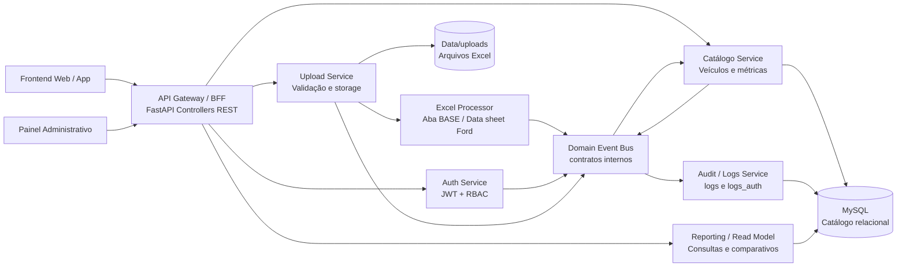

# MEMBROS
- Douglas dos Santos Melo RM556439
- Henrique Sanches RM557959
- João Pedro Kraide Máximo RM563166
- Matheus Marcelino Dantas da Silva RM556332
- Nicolas Caciolato reis RM556506

# Projeto Base - Sistema Veículos (SOA + Cyber)
Aplicação web e API em Python (FastAPI) com:
- cadastro/login de usuários
- autenticação JWT com payload em Base64
- cadastro e consulta de veículos
- upload simples de Excel
- processamento estruturado de Excel para alimentar catálogo
- logs/auditoria conforme schema relacional solicitado

## Diagrama arquitetural



## Schema de banco (atual)

Tabelas implementadas no codigo:
- `users`
- `marcas`
- `modelos`
- `versoes`
- `veículos`
- `metricas_veiculos`
- `logs`
- `logs_auth`
- `password_reset_tokens`

Importante:
- A aplicação **não recria tabelas automaticamente** no startup.
- O script SQL do schema fica em `app/db/schema.sql`.
- Para criar/recriar o banco MySQL `veículos_db`, execute `py -3 -m app.db.init_db`.

## Contratos dos endpoints utilizados

Base URL local: `http://127.0.0.1:8000`

Prefixo da API: `/api/v1`

Formato padrão:
- Endpoints JSON usam `Content-Type: application/json`.
- Endpoints protegidos exigem `Authorization: Bearer <access_token>`.
- Erros do FastAPI retornam `{ "detail": "mensagem" }` ou `{ "detail": { ... } }`.
- Campos de texto passam por sanitizacao antes de chegar nas regras de negocio.

### Resumo dos contratos

| Método | Endpoint | Autenticacao | Perfis | Uso |
|---|---|---|---|---|
| `POST` | `/api/v1/auth/register` | Não | Publico | Cadastrar usuario comum |
| `POST` | `/api/v1/auth/login` | Não | Publico | Gerar token JWT |
| `POST` | `/api/v1/veiculos/comparar` | Sim | `admin`, `analista`, `user` | Consultar veiculo e atributos |
| `POST` | `/api/v1/veiculos` | Sim | `admin` | Cadastrar veiculo no catalogo |
| `POST` | `/api/v1/uploads/excel` | Sim | `admin`, `analista`, `user` | Enviar arquivo Excel |
| `POST` | `/api/v1/uploads/excel/processar` | Sim | `admin`, `analista` | Processar Excel para catalogo |
| `POST` | `/api/v1/admin/retencao/expurgar` | Sim | `admin` | Executar retencao e descarte seguro |
| `GET` | `/health/db` | Não | Publico | Verificar conexao com o banco |

### `POST /api/v1/auth/register`

Cadastra um usuário novo. Mesmo que o payload aceite `role`, o backend sempre cria cadastro público com perfil `user` para evitar elevação de privilégio.

Request body:

```json
{
  "nome": "Maria Analista",
  "email": "maria@example.com",
  "password": "SenhaForte123",
  "role": "user"
}
```

Campos:
- `nome`: opcional, string, ate 120 caracteres.
- `email`: obrigatório, string, ate 120 caracteres, normalizado antes de salvar.
- `password`: obrigatório, string, de 8 a 120 caracteres, validado por regra de forca de senha.
- `role`: opcional no contrato de entrada, mas ignorado para cadastro publico; o valor efetivo salvo e `user`.

Resposta `201 Created`:

```json
{
  "status": "sucesso",
  "id": 1,
  "nome": "Maria Analista",
  "email": "maria@example.com",
  "role": "user"
}
```

Erros esperados:
- `400 Bad Request`: email já cadastrado, role inválida no payload ou senha fora da política.
- `422 Unprocessable Entity`: payload fora do schema.

Efeitos colaterais:
- Cria registro em `users`.
- Publica evento `SUCESSO_CADASTRO` para auditoria.

### `POST /api/v1/auth/login`

Autentica o usuário e retorna JWT Bearer.

Request body com `email`:

```json
{
  "email": "maria@example.com",
  "password": "SenhaForte123"
}
```

Request body alternativo com `username`:

```json
{
  "username": "maria@example.com",
  "password": "SenhaForte123"
}
```

Campos:
- `email` ou `username`: um dos dois e obrigatório.
- `password`: obrigatório, string, de 8 a 120 caracteres.

Resposta `200 OK`:

```json
{
  "access_token": "jwt.assinado.aqui",
  "token_type": "bearer",
  "expires_in_minutes": 60,
  "email": "maria@example.com",
  "role": "user",
  "nome": "Maria Analista"
}
```

Erros esperados:
- `401 Unauthorized`: usuário ou senha incorretos.
- `422 Unprocessable Entity`: payload fora do schema.

Efeitos colaterais:
- Registra tentativa em `logs_auth`.
- Em sucesso, pública evento `SUCESSO_AUTENTICACAO`.
- Em falha para usuário existente, publica evento `FALHA_AUTENTICACAO`.

Detalhes do token:
- JWT inclui `sub`, `role`, `cred_fingerprint`, `dados_base64`, `iat` e `exp`.
- O RBAC valida assinatura, expiracao, integridade do Base64 e fingerprint atual da credencial.

### `POST /api/v1/veiculos/comparar`

Consulta o catálogo por `marca`, `modelo` e `versao`, retornando dados técnicos principais e os atributos livres solicitados.

Headers:

```http
Authorization: Bearer <access_token>
Content-Type: application/json
```

Request body:

```json
{
  "marca": "FORD",
  "modelo": "Ranger",
  "versao": "XLT",
  "atributos_desejados": ["Airbag", "Controle de estabilidade"]
}
```

Campos:
- `marca`: obrigatório, string, até 255 caracteres.
- `modelo`: obrigatório, string, até 100 caracteres.
- `versao`: obrigatório, string, até 100 caracteres.
- `atributos_desejados`: opcional, lista de strings, até 20 itens.

Resposta `200 OK`:

```json
{
  "marca": "FORD",
  "modelo": "Ranger",
  "versao": "XLT",
  "dados_tecnicos_principais": {
    "motorizacao": "2.0L Diesel",
    "potencia_cv": 170,
    "transmissao": "Automática 10 marchas",
    "tracao": "4x4",
    "preco_sugerido": "250000.00"
  },
  "equipamentos_pesquisados_livres": {
    "Airbag": true,
    "Controle de estabilidade": "vázio / não disponivel"
  }
}
```

Observações de resposta:
- Se o veículo não existir, os campos tecnicos retornam `"´vázio / não disponível"`.
- Os atributos livres são buscados em `metricas_veiculos.pacote_equipamentos` da métrica mais recente.

Erros esperados:
- `401 Unauthorized`: token ausente, inválido, expirado ou com fingerprint divergente.
- `403 Forbidden`: perfil fora da lista permitida.
- `422 Unprocessable Entity`: payload fora do schema.

Efeitos colaterais:
- Quando o perfil e `analista`, publica evento `EXTRACAO_COMPETITIVA`.

### `POST /api/v1/veiculos`

Cadastra um véiculo e cria a métrica inicial.

Headers:

```http
Authorization: Bearer <access_token>
Content-Type: application/json
```

Request body:

```json
{
  "marca": "FORD",
  "modelo": "Ranger",
  "versao": "XLT",
  "motorizacao": "2.0L Diesel",
  "potencia_cv": 170,
  "transmissao": "Automatica 10 marchas",
  "tracao": "4x4",
  "preco_sugerido": 250000.00,
  "pacote_equipamentos": {
    "Airbag": true,
    "Controle de estabilidade": true
  },
  "observacao": "Cadastro manual"
}
```

Campos:
- `marca`: obrigatório, string, até 255 caracteres.
- `modelo`, `versao`, `motorizacao`: obrigatórios, string, até 100 caracteres.
- `potencia_cv`: obrigatório, inteiro maior ou igual a 1.
- `transmissao`, `tracao`: obrigatórios, string, até 50 caracteres.
- `preco_sugerido`: obrigatório, decimal maior ou igual a 0.
- `pacote_equipamentos`: opcional, objeto JSON.
- `observacao`: opcional, string, até 120 caracteres.

Resposta `201 Created`:

```json
{
  "status": "sucesso",
  "id": 10,
  "metrica_id": 25
}
```

Erros esperados:
- `400 Bad Request`: veiculo ja cadastrado no catálogo.
- `401 Unauthorized`: token ausente, invalido, expirado ou com fingerprint divergente.
- `403 Forbidden`: usuario sem perfil `admin`.
- `422 Unprocessable Entity`: payload fora do schema.

Efeitos colaterais:
- Faz upsert de `marcas`, `modelos` e `versoes`.
- Cria registro em `veiculos`.
- Cria registro em `metricas_veiculos`.
- Publica evento `CADASTRO_VEICULO`.

Observação de banco:
- `metricas_veiculos.preco_sugerido` permite `NULL` para cenários de importação com preço pendente, mas neste endpoint o campo e obrigatório.

### `POST /api/v1/uploads/excel`

Recebe e armazena um arquivo Excel sem processar o catálogo.

Headers:

```http
Authorization: Bearer <access_token>
Content-Type: multipart/form-data
```

Form data:
- `arquivo`: obrigatório, arquivo `.xlsx` ou `.xls`.

Exemplo com `curl`:

```bash
curl -X POST http://127.0.0.1:8000/api/v1/uploads/excel \
  -H "Authorization: Bearer <access_token>" \
  -F "arquivo=@datasheet.xlsx"
```

Resposta `201 Created`:

```json
{
  "status": "sucesso",
  "mensagem": "Upload realizado com sucesso.",
  "caminho_arquivo": "data/uploads/arquivo.xlsx.enc",
  "nome_arquivo": "datasheet.xlsx",
  "metrica_id": null
}
```

Erros esperados:
- `400 Bad Request`: extensão inválida, MIME não permitido, arquivo vazio, tamanho acima do limite ou nome inválido.
- `401 Unauthorized`: token ausente, inválido, expirado ou com fingerprint divergente.
- `403 Forbidden`: perfil fora da lista permitida.
- `422 Unprocessable Entity`: campo `arquivo` ausente.

Efeitos colaterais:
- Salva o arquivo em `UPLOAD_DIR`.
- Publica evento `ENVIO_INFORMACOES_EXCEL`.
- Quando ainda não existe métrica vinculada, `logs.metrica_veiculo_id` fica `NULL`.

### `POST /api/v1/uploads/excel/processar`

Recebe um `.xlsx`, interpreta a aba `BASE` e alimenta o catalogo automotivo.

Headers:

```http
Authorization: Bearer <access_token>
Content-Type: multipart/form-data
```

Form data:
- `arquivo`: obrigatorio, arquivo `.xlsx`.

Regras da planilha:
- A aba obrigatória deve se chamar `BASE`.
- A primeira coluna do cabeçalho deve ser `Equipamentos`.
- Cada coluna de versão representa uma configuração de veículo do mesmo modelo.
- O modelo e lido da segunda linha.
- A marca e detectada na planilha; se não for encontrada, usa `FORD`.
- Cada importação cria nova linha historica em `metricas_veiculos`; snapshots anteriores não são sobrescritos.

Resposta `201 Created`:

```json
{
  "status": "sucesso",
  "mensagem": "Processamento de Excel concluido com sucesso.",
  "marca": "FORD",
  "modelo": "Ranger",
  "versoes_processadas": 3,
  "veiculos_criados": 3,
  "metricas_criadas": 3,
  "erros_validacao": []
}
```

Resposta `400 Bad Request` para validação da planilha:

```json
{
  "detail": {
    "mensagem": "Falha de validacao da planilha.",
    "erros_validacao": [
      "A primeira coluna deve ser 'Equipamentos'."
    ]
  }
}
```

Erros esperados:
- `400 Bad Request`: extensão diferente de `.xlsx`, aba `BASE` ausente, cabeçalho inválido, modelo ausente, versão ausente ou potência inválida.
- `401 Unauthorized`: token ausente, inválido, expirado ou com fingerprint divergente.
- `403 Forbidden`: usuário sem perfil `admin` ou `analista`.
- `422 Unprocessable Entity`: campo `arquivo` ausente.

Efeitos colaterais:
- Faz upsert em `marcas -> modelos -> versoes -> veiculos`.
- Cria métricas históricas em `metricas_veiculos`.
- Publica um evento `IMPORTACAO_EXCEL_PROCESSADA` por métrica criada.
- Publica um evento `ENVIO_INFORMACOES_EXCEL` com arquivo, MIME, tamanho, aba de origem, marca, modelo, versões e totais processados.

### `GET /health/db`

Verifica se a aplicação consegue executar `SELECT 1` no banco configurado.

Resposta `200 OK`:

```json
{
  "status": "ok",
  "database": "conectado"
}
```

Erros esperados:
- `500 Internal Server Error`: falha de conexão ou execução no banco.

### `POST /api/v1/admin/retencao/expurgar`

Executa a política de retenção configurada no `.env`, removendo logs antigos, logs de autenticação antigos, tokens de reset expirados e uploads fora do prazo.

Headers:

```http
Authorization: Bearer <access_token>
Content-Type: application/json
```

Resposta `200 OK`:

```json
{
  "status": "sucesso",
  "admin_id": 1,
  "logs_removidos": 10,
  "logs_auth_removidos": 5,
  "tokens_expirados_removidos": 2,
  "uploads_removidos": 3
}
```

Erros esperados:
- `401 Unauthorized`: token ausente, inválido, expirado ou com fingerprint divergente.
- `403 Forbidden`: usuário sem perfil `admin`.

### Rotas web servidas pela aplicação

Essas rotas retornam HTML e não fazem parte do contrato JSON da API:

| Metodo | Rota | Comportamento |
|---|---|---|
| `GET` | `/` | Renderiza a tela de login |
| `GET` | `/login` | Renderiza a tela de login |
| `GET` | `/registro` | Renderiza a tela de cadastro |
| `GET` | `/enviar-arquivo` | Exige cookie de sessão válido e renderiza upload |
| `GET` | `/upload` | Exige cookie de sessão válido e renderiza upload |

## Controles de Cybersecurity implementados

### 1. Seguranca de entrada e validacao de dados

- Schemas Pydantic limitam tamanho e tipo de entrada em usuários, login, consulta e cadastro de veículos.
- Campos `marca`, `modelo`, `versao`, `motorizacao`, `transmissao`, `tracao` e `atributos_desejados` passam por sanitização e validação de padrão textual.
- Uploads validam extensão, MIME, nome seguro, tamanho máximo, limite de linhas e limite de colunas da planilha.
- O middleware bloqueia payload flooding por `Content-Length`.
- Exceções internas são encapsuladas em resposta genérica, sem stack trace para o usuário.
- Acesso ao banco usa ORM SQLAlchemy nas consultas de negócio, reduzindo risco de SQL injection.

### 2. Autenticação e autorização

- Senhas são armazenadas com bcrypt sobre o material `email_normalizado + ":" + senha`.
- JWT possui assinatura, `iat`, `exp`, `role`, `cred_fingerprint` e `dados_base64`.
- O RBAC valida token, usuário ativo, fingerprint atual da credencial e perfil permitido por endpoint.
- Cadastro público sempre cria `role=user`, mesmo que outro papel seja enviado no payload.

### 3. Proteção de APIs e serviços

- CORS e restrito por `CORS_ALLOWED_ORIGINS`.
- Rate limiting em memoria aplica limite por IP.
- HTTPS pode ser exigido por `FORCE_HTTPS=true`; certificados TLS são configurados por `SSL_CERTFILE` e `SSL_KEYFILE`.
- HSTS e enviado quando a requisicao chega por HTTPS ou `X-Forwarded-Proto: https`.
- Assinatura HMAC de payload JSON pode ser exigida por `REQUIRE_PAYLOAD_SIGNATURE=true`.
- Para assinar um payload JSON, envie:
  - `X-Payload-Timestamp`: timestamp Unix em segundos.
  - `X-Payload-Signature`: `sha256=<hmac_hex>`.
  - Base cânonica do HMAC: `METHOD + "\n" + PATH + "\n" + QUERY + "\n" + TIMESTAMP + "\n" + SHA256_DO_CORPO`.
- Rotas públicas de autenticação ficam isentas por padrão em `PAYLOAD_SIGNATURE_EXEMPT_PATHS`, porque o segredo HMAC não deve ser exposto no frontend.

### 4. Segurança de dados e privacidade

- Dados pessoais em logs de auditoria e logs de autenticação são pseudonimizados por HMAC quando `ANONYMIZE_AUDIT_PII=true`.
- Campos sensiveis como senha, token, segredo e authorization são removidos dos payloads de auditoria.
- Arquivos enviados no upload simples são criptografados antes de serem gravados em `UPLOAD_DIR` quando `ENCRYPT_UPLOADS_AT_REST=true`.
- A chave de criptografia pode ser definida em `DATA_ENCRYPTION_KEY`; se omitida, a aplicação deriva uma chave a partir de `PAYLOAD_SECRET_HMAC`.
- Políticas configuráveis de retenção controlam logs de auditoria, logs de autenticação e uploads.
- O endpoint administrativo `/api/v1/admin/retencao/expurgar` executa o descarte seguro configurado.

### 5. Monitoramento, logs e auditoria

- Eventos de cadastro, login, falha de autenticação, upload, processamento de Excel, cadastro de veículo e extração competitiva são auditados.
- Logs registram usuario, ação, IP pseudonimizado, user-agent pseudonimizado e contexto da operação.
- Falhas internas são logadas no servidor e não expostas ao cliente.
- Testes automatizados validam upload, importação, histórico, RBAC, resistência básica a SQL injection, pseudominização, retenção e exigência de assinatura HMAC.

## Melhorias futuras

Para evoluir o sistema, a principal melhoria planejada e ampliar a captação de informações para preencher automaticamente tabelas que podem permanecer vazias enquanto determinados fluxos ainda não forem usados.

Prioridades sugeridas:
- Criar fluxo de recuperação de senha para popular `password_reset_tokens`, com solicitação de reset, token temporário, expiração e invalidação após uso.
- Criar tela administrativa para cadastro assistido de marcas, modelos, versões e veículos, reduzindo depedência exclusiva do upload Excel para alimentar `marcas`, `modelos`, `versoes`, `veículos` e `metricas_veiculos`.
- Expandir o processamento de Excel para reconhecer mais abas e layouts, captando preço sugerido, observações, atributos técnicos e pacotes de equipamentos com maior completude.
- Criar rotina de importação incremental para arquivos já armazenados em `data/uploads`, permitindo reprocessar uploads antigos e preencher catálgo/métrica quando o upload simples ainda não tiver sido processado.
- Registrar eventos de auditoria mais completos para popular `logs` em ações de consulta, cadastro, importacao, falha de validação e alteração de dados.
- Manter `logs_auth` alimentada por tentativas de login, logout, falhas de credencial e bloqueios por RBAC, permitindo análise posterior de segurança.
- Criar um painel de qualidade de dados indicando tabelas vázias, registros incompletos e campos pendentes, como `preco_sugerido` nulo em métricas importadas.

Fluxo futuro esperado:
1. Usuário envia ou cadastra dados pela interface.
2. A aplicação valida e normaliza as informações.
3. O barramento de eventos internos pública a ação realizada.
4. O catálogo grava dados nas tabelas relacionais.
5. A auditoria registra a operação em `logs` ou `logs_auth`.
6. O painel administrativo mostra pendências de preenchimento e permite complementar dados ausentes.

## Configuração

Use `.env` (ou variáveis de ambiente), com base em `.env.example`.

Principal:
- `APP_ENV`
- `DB_HOST`, `DB_PORT`, `DB_USER`, `DB_PASSWORD`, `DB_NAME`
- `DATABASE_URL` (opcional; sobrescreve os campos `DB_*`)
- `SECRET_KEY`
- `ALGORITHM`
- `ACCESS_TOKEN_EXPIRE_MINUTES`
- `PAYLOAD_SECRET_HMAC`
- `DATA_ENCRYPTION_KEY`
- `ENCRYPT_UPLOADS_AT_REST`
- `REQUIRE_PAYLOAD_SIGNATURE`
- `PAYLOAD_SIGNATURE_EXEMPT_PATHS`
- `PAYLOAD_SIGNATURE_MAX_AGE_SECONDS`
- `FORCE_HTTPS`
- `SSL_CERTFILE`, `SSL_KEYFILE`
- `CORS_ALLOWED_ORIGINS`
- `UPLOAD_DIR`
- `MAX_UPLOAD_FILE_SIZE_MB`
- `MAX_CONTENT_LENGTH_KB`
- `MAX_EXCEL_ROWS`, `MAX_EXCEL_COLUMNS`
- `ANONYMIZE_AUDIT_PII`
- `AUDIT_LOG_RETENTION_DAYS`, `AUTH_LOG_RETENTION_DAYS`, `UPLOAD_RETENTION_DAYS`

### Certificado TLS local

Quando `FORCE_HTTPS=true`, a aplicação passa a recusar acessos por `http://` e exige `https://`. Para isso funcionar corretamente, configure tambem:

```env
FORCE_HTTPS=true
SSL_CERTFILE=certs/local-cert.pem
SSL_KEYFILE=certs/local-key.pem
```

Para gerar um certificado local autoassinado para desenvolvimento/apresentação, execute na raiz do projeto:

```powershell
mkdir certs
py -3 -c "from cryptography import x509; from cryptography.x509.oid import NameOID; from cryptography.hazmat.primitives import hashes, serialization; from cryptography.hazmat.primitives.asymmetric import rsa; from datetime import datetime, timedelta, timezone; import ipaddress, pathlib; key=rsa.generate_private_key(public_exponent=65537,key_size=2048); subject=x509.Name([x509.NameAttribute(NameOID.COMMON_NAME,'localhost')]); cert=x509.CertificateBuilder().subject_name(subject).issuer_name(subject).public_key(key.public_key()).serial_number(x509.random_serial_number()).not_valid_before(datetime.now(timezone.utc)).not_valid_after(datetime.now(timezone.utc)+timedelta(days=365)).add_extension(x509.SubjectAlternativeName([x509.DNSName('localhost'),x509.IPAddress(ipaddress.ip_address('127.0.0.1'))]),critical=False).sign(key,hashes.SHA256()); pathlib.Path('certs').mkdir(exist_ok=True); pathlib.Path('certs/local-key.pem').write_bytes(key.private_bytes(serialization.Encoding.PEM,serialization.PrivateFormat.TraditionalOpenSSL,serialization.NoEncryption())); pathlib.Path('certs/local-cert.pem').write_bytes(cert.public_bytes(serialization.Encoding.PEM))"
```

Depois execute a aplicação e acesse:

```text
https://127.0.0.1:8000
```

Observação: por ser autoassinado, o navegador pode mostrar um alerta de certificado não confiavel. Isso e esperado em ambiente local. Em um cenário futuro em que a aplicação seja promovida para um ambiente publicado/produção, o certificado local deve ser substituído por um certificado válido emitido por uma autoridade confiável, como Let's Encrypt, Cloudflare ou o provedor de nuvem.

## Execução

```bash
py -3 -m pip install -r requirements.txt
py -3 -m app.db.init_db
py -3 run.py
```

Teste de conexao:

```bash
curl http://127.0.0.1:8000/health/db
```
