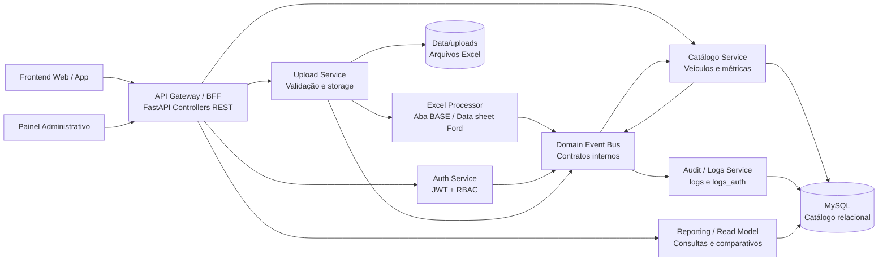

# MEMBROS
- Douglas dos Santos Melo — RM556439
- Henrique Sanches — RM557959
- João Pedro Kraide Máximo — RM563166
- Matheus Marcelino Dantas da Silva — RM556332
- Nicolas Caciolato Reis — RM556506

# Ford Challenge — Sistema de Inteligência Competitiva Automotiva

Aplicação web e API desenvolvida em Python com FastAPI para gerenciamento, processamento e análise de informações automotivas.

Principais funcionalidades:

- cadastro e autenticação de usuários;
- autenticação JWT com controle de acesso baseado em perfis (RBAC);
- perfis `user`, `analista` e `admin`;
- cadastro, consulta e comparação de veículos;
- upload e processamento estruturado de arquivos Excel;
- painel administrativo;
- logs de autenticação e auditoria;
- criptografia de arquivos em repouso;
- proteção da API com rate limiting, validação de entrada e headers de segurança;
- suporte a HTTPS/TLS;
- pipeline DevSecOps com testes automatizados e scanners de segurança;
- execução através de Docker.

## Diagrama arquitetural


```mermaid
flowchart LR
    web[Frontend Web / App] --> api[API Gateway / BFF<br/>FastAPI Controllers REST]
    admin[Painel Administrativo] --> api

    api --> auth[Auth Service<br/>JWT + RBAC]
    api --> uploads[Upload Service<br/>Validação e storage]
    api --> veiculos[Catálogo Service<br/>Veículos e métricas]

    uploads --> storage[(Data/uploads<br/>Arquivos Excel)]
    uploads --> parser[Excel Processor<br/>Aba BASE / Data sheet Ford]
    parser --> eventos[Domain Event Bus<br/>Contratos internos]
    eventos --> veiculos

    veiculos --> db[(MySQL<br/>Catálogo relacional)]
    auth --> eventos
    uploads --> eventos
    veiculos --> eventos
    eventos --> logs[Audit / Logs Service<br/>logs e logs_auth]
    logs --> db

    api --> reporting[Reporting / Read Model<br/>Consultas e comparativos]
    reporting --> db
```

## Schema de banco atual

Tabelas implementadas:

- `users`
- `marcas`
- `modelos`
- `versoes`
- `veiculos`
- `metricas_veiculos`
- `logs`
- `logs_auth`
- `password_reset_tokens`

Importante:

- A aplicação não recria as tabelas automaticamente durante o startup.
- O schema SQL está disponível em `app/db/schema.sql`.
- Para criar ou recriar o banco MySQL `veiculos_db`, execute:

```bash
py -3 -m app.db.init_db
```

## Contratos dos endpoints utilizados

Base URL local:

```text
http://127.0.0.1:8000
```

Prefixo da API:

```text
/api/v1
```

Formato padrão:

- endpoints JSON usam `Content-Type: application/json`;
- endpoints protegidos exigem `Authorization: Bearer <access_token>`;
- endpoints protegidos utilizam o esquema Bearer documentado na documentação OpenAPI;
- erros de validação seguem o contrato padrão do FastAPI com `{ "detail": ... }`;
- campos de texto passam por sanitização antes de chegar às regras de negócio.

### Resumo dos contratos

| Método | Endpoint | Autenticação | Perfis | Uso |
|---|---|---|---|---|
| `POST` | `/api/v1/auth/register` | Não | Público | Cadastrar usuário comum |
| `POST` | `/api/v1/auth/login` | Não | Público | Gerar token JWT |
| `POST` | `/api/v1/auth/password/reset` | Não | Token de uso único | Definir/redefinir senha sem armazenar token bruto |
| `GET` | `/api/v1/veiculos` | Sim | `admin`, `analista`, `user` | Listar e filtrar veículos |
| `GET` | `/api/v1/veiculos/{id}` | Sim | `admin`, `analista`, `user` | Consultar um veículo |
| `GET` | `/api/v1/veiculos/comparar` | Sim | `admin`, `analista`, `user` | Comparar/consultar veículo por parâmetros |
| `POST` | `/api/v1/veiculos/comparar` | Sim | `admin`, `analista`, `user` | Compatibilidade legada para consulta |
| `POST` | `/api/v1/veiculos` | Sim | `admin` | Cadastrar veículo no catálogo |
| `PATCH` | `/api/v1/veiculos/{id}` | Sim | `admin` | Atualizar parcialmente um veículo |
| `DELETE` | `/api/v1/veiculos/{id}` | Sim | `admin` | Remover logicamente um veículo |
| `POST` | `/api/v1/uploads/excel` | Sim | `admin`, `analista`, `user` | Enviar arquivo Excel |
| `POST` | `/api/v1/uploads/excel/processar` | Sim | `admin`, `analista` | Processar Excel para o catálogo |
| `GET` | `/api/v1/admin/dashboard` | Sim | `admin` | Painel com indicadores de usuários, catálogo, auditoria e Sprint 3 |
| `GET` | `/api/v1/admin/comparacoes/veiculos` | Sim | `admin` | Comparar dois veículos diretamente do banco |
| `POST` | `/api/v1/admin/retencao/expurgar` | Sim | `admin` | Executar retenção e descarte seguro |
| `GET` | `/api/v1/admin/usuarios` | Sim | `admin` | Listar usuários sem expor senhas |
| `POST` | `/api/v1/admin/usuarios` | Sim | `admin` | Criar usuário e gerar convite de senha |
| `PATCH` | `/api/v1/admin/usuarios/{id}/role` | Sim | `admin` | Alterar role de usuário |
| `POST` | `/api/v1/admin/usuarios/{id}/redefinir-senha` | Sim | `admin` | Gerar link temporário de redefinição |
| `GET` | `/health/db` | Não | Público | Verificar conexão com o banco |

### Painel administrativo — Sprint 3

O sistema possui uma área exclusiva para usuários com `role = admin`, acessível em:

```text
http://127.0.0.1:8000/admin
```

O painel consolida em uma única tela:

- indicadores reais do banco: usuários por perfil, veículos, marcas, modelos, versões e métricas;
- observabilidade: quantidade de logs de auditoria e tentativas de autenticação, separando sucessos e falhas;
- evidências organizadas dos quatro blocos da Sprint 3: Pipeline DevSecOps, Segurança em Código e Infraestrutura, Observabilidade/Resposta e Compliance/Segurança Contínua;
- comparação administrativa de dois veículos cadastrados, consultando os registros e as últimas métricas diretamente no banco.

A comparação fica disponível em:

```text
GET /api/v1/admin/comparacoes/veiculos?veiculo_id_a=1&veiculo_id_b=2
```

Ela apresenta potência, preço, motorização, transmissão, tração, equipamentos e diferenças numéricas.

O cadastro público continua criando somente usuários com `role = user`. No painel administrativo, o administrador pode criar contas assistidas e escolher entre `user`, `analista` e `admin`.

A conta administrativa é criada sem receber uma senha em texto claro. O sistema gera um token aleatório de uso único, armazena apenas o hash SHA-256 desse token em `password_reset_tokens` e devolve o link temporário para envio ao usuário.

O administrador também pode alterar a role de uma conta e gerar um novo link de redefinição de senha. Ao abrir o link, o usuário define a própria senha. O token é invalidado após o uso ou expiração.

As senhas armazenadas na tabela `users` não ficam disponíveis em texto puro. O campo `password` armazena apenas o hash bcrypt derivado da credencial, e a senha escolhida pelo usuário nunca é devolvida pela API.

### Testes da área administrativa

Os testes de API também cobrem:

- acesso do administrador ao dashboard;
- bloqueio de usuário comum com `403 Forbidden`;
- comparação de dois veículos utilizando dados persistidos no banco de teste.

Execute com:

```bash
py -3 -m pytest -v
```

### `POST /api/v1/auth/register`

Cadastra um novo usuário. Mesmo que o payload possua o campo `role`, o backend sempre cria o cadastro público com perfil `user`, evitando elevação de privilégio por meio do endpoint público.

Request body:

```json
{
  "nome": "Maria Analista",
  "email": "maria@example.com",
  "password": "SenhaForte123",
  "role": "user"
}
```

Campos:

- `nome`: opcional, string, até 120 caracteres;
- `email`: obrigatório, string, até 120 caracteres, normalizado antes de salvar;
- `password`: obrigatório, string, de 8 a 120 caracteres e validado pela política de senha;
- `role`: opcional no contrato de entrada, porém ignorado para o cadastro público; o valor efetivo salvo é `user`.

Resposta `201 Created`:

```json
{
  "status": "sucesso",
  "id": 1,
  "nome": "Maria Analista",
  "email": "maria@example.com",
  "role": "user"
}
```

Erros esperados:

- `400 Bad Request`: e-mail já cadastrado ou erro de regra de negócio;
- `422 Unprocessable Entity`: payload fora do schema, role inválida ou senha fora da política definida pelo schema.

Efeitos colaterais:

- cria registro em `users`;
- publica evento `SUCESSO_CADASTRO` para auditoria.

### `POST /api/v1/auth/login`

Autentica o usuário e retorna um token JWT Bearer.

Request body com `email`:

```json
{
  "email": "maria@example.com",
  "password": "SenhaForte123"
}
```

Request body alternativo com `username`:

```json
{
  "username": "maria@example.com",
  "password": "SenhaForte123"
}
```

Campos:

- `email` ou `username`: um dos dois é obrigatório;
- `password`: obrigatório, string, de 8 a 120 caracteres.

Resposta `200 OK`:

```json
{
  "access_token": "jwt.assinado.aqui",
  "token_type": "bearer",
  "expires_in_minutes": 60,
  "email": "maria@example.com",
  "role": "user",
  "nome": "Maria Analista"
}
```

Erros esperados:

- `401 Unauthorized`: usuário ou senha incorretos;
- `422 Unprocessable Entity`: payload fora do schema.

Efeitos colaterais:

- registra tentativa em `logs_auth`;
- em sucesso, publica evento `SUCESSO_AUTENTICACAO`;
- em falha para usuário existente, publica evento `FALHA_AUTENTICACAO`.

Detalhes do token:

- o JWT inclui `sub`, `role`, `cred_fingerprint`, `dados_base64`, `iat` e `exp`;
- o RBAC valida assinatura, expiração, integridade do conteúdo e fingerprint atual da credencial.

> `dados_base64` é um campo codificado em Base64 dentro do token. Base64 não deve ser tratado como mecanismo de criptografia ou confidencialidade.

### `GET /api/v1/veiculos`

Lista veículos ativos do catálogo. Aceita filtros opcionais `marca`, `modelo`, `versao`, `skip` e `limit`.

Exemplo:

```text
GET /api/v1/veiculos?marca=FORD&modelo=Ranger&limit=20
```

Resposta `200 OK`:

```json
{
  "itens": [
    {
      "id": 10,
      "marca": "FORD",
      "modelo": "Ranger",
      "versao": "XLT",
      "motorizacao": "2.0L Diesel",
      "potencia_cv": 170,
      "transmissao": "Automatica",
      "tracao": "4x4",
      "preco_sugerido": "250000.00",
      "pacote_equipamentos": {},
      "observacao": null,
      "ativo": true
    }
  ],
  "skip": 0,
  "limit": 20,
  "total": 1
}
```

### `GET /api/v1/veiculos/{id}`

Consulta um veículo específico. Retorna `404 Not Found` quando o recurso não existe ou já foi removido logicamente.

### `GET /api/v1/veiculos/comparar`

Representa a comparação como consulta HTTP `GET`.

Exemplo:

```text
GET /api/v1/veiculos/comparar?marca=FORD&modelo=Ranger&versao=XLT&atributos_desejados=Airbag&atributos_desejados=Controle%20de%20estabilidade
```

Retorna o mesmo contrato de dados da comparação legada em `POST`.

### `PATCH /api/v1/veiculos/{id}`

Atualiza parcialmente os dados técnicos e/ou a última métrica do veículo. Disponível somente para `admin`.

Exemplo:

```json
{
  "potencia_cv": 200,
  "preco_sugerido": 260000.00
}
```

Resposta `200 OK` com o identificador e os dados atualizados do recurso.

Erros:

- `404 Not Found`: veículo inexistente ou inativo;
- `409 Conflict`: combinação marca/modelo/versão já possui outro veículo ativo;
- `422 Unprocessable Entity`: payload inválido.

### `DELETE /api/v1/veiculos/{id}`

Executa remoção lógica, alterando o status do veículo para inativo e preservando histórico e métricas. Disponível somente para `admin`.

Resposta:

```text
204 No Content
```

### `POST /api/v1/veiculos/comparar`

Consulta o catálogo por `marca`, `modelo` e `versao`, retornando os dados técnicos principais e os atributos livres solicitados.

Headers:

```http
Authorization: Bearer <access_token>
Content-Type: application/json
```

Request body:

```json
{
  "marca": "FORD",
  "modelo": "Ranger",
  "versao": "XLT",
  "atributos_desejados": ["Airbag", "Controle de estabilidade"]
}
```

Campos:

- `marca`: obrigatório, string, até 255 caracteres;
- `modelo`: obrigatório, string, até 100 caracteres;
- `versao`: obrigatório, string, até 100 caracteres;
- `atributos_desejados`: opcional, lista de strings, até 20 itens.

Resposta `200 OK`:

```json
{
  "marca": "FORD",
  "modelo": "Ranger",
  "versao": "XLT",
  "dados_tecnicos_principais": {
    "motorizacao": "2.0L Diesel",
    "potencia_cv": 170,
    "transmissao": "Automática 10 marchas",
    "tracao": "4x4",
    "preco_sugerido": "250000.00"
  },
  "equipamentos_pesquisados_livres": {
    "Airbag": true,
    "Controle de estabilidade": "vazio / não disponível"
  }
}
```

Observações de resposta:

- se o veículo não existir, os campos técnicos podem retornar informação de indisponibilidade conforme o contrato atual;
- os atributos livres são buscados em `metricas_veiculos.pacote_equipamentos` da métrica mais recente.

Erros esperados:

- `401 Unauthorized`: token ausente, inválido, expirado ou com fingerprint divergente;
- `403 Forbidden`: perfil fora da lista permitida;
- `422 Unprocessable Entity`: payload fora do schema.

Efeitos colaterais:

- quando o perfil é `analista`, publica evento `EXTRACAO_COMPETITIVA`.

### `POST /api/v1/veiculos`

Cadastra um veículo e cria sua métrica inicial.

Headers:

```http
Authorization: Bearer <access_token>
Content-Type: application/json
```

Request body:

```json
{
  "marca": "FORD",
  "modelo": "Ranger",
  "versao": "XLT",
  "motorizacao": "2.0L Diesel",
  "potencia_cv": 170,
  "transmissao": "Automatica 10 marchas",
  "tracao": "4x4",
  "preco_sugerido": 250000.00,
  "pacote_equipamentos": {
    "Airbag": true,
    "Controle de estabilidade": true
  },
  "observacao": "Cadastro manual"
}
```

Campos:

- `marca`: obrigatório, string, até 255 caracteres;
- `modelo`, `versao`, `motorizacao`: obrigatórios, string, até 100 caracteres;
- `potencia_cv`: obrigatório, inteiro maior ou igual a 1;
- `transmissao`, `tracao`: obrigatórios, string, até 50 caracteres;
- `preco_sugerido`: obrigatório, decimal maior ou igual a 0;
- `pacote_equipamentos`: opcional, objeto JSON;
- `observacao`: opcional, string, até 120 caracteres.

Resposta `201 Created`:

```json
{
  "status": "sucesso",
  "id": 10,
  "metrica_id": 25
}
```

Erros esperados:

- `400 Bad Request`: veículo já cadastrado no catálogo;
- `401 Unauthorized`: token ausente, inválido, expirado ou com fingerprint divergente;
- `403 Forbidden`: usuário sem perfil `admin`;
- `422 Unprocessable Entity`: payload fora do schema.

Efeitos colaterais:

- realiza upsert de `marcas`, `modelos` e `versoes`;
- cria registro em `veiculos`;
- cria registro em `metricas_veiculos`;
- publica evento `CADASTRO_VEICULO`.

Observação de banco:

- `metricas_veiculos.preco_sugerido` permite `NULL` para cenários de importação com preço pendente, porém neste endpoint o campo é obrigatório.

### `POST /api/v1/uploads/excel`

Recebe e armazena um arquivo Excel sem processar o catálogo.

Headers:

```http
Authorization: Bearer <access_token>
Content-Type: multipart/form-data
```

Form data:

- `arquivo`: obrigatório, arquivo `.xlsx` ou `.xls`.

Exemplo com `curl`:

```bash
curl -X POST http://127.0.0.1:8000/api/v1/uploads/excel \
  -H "Authorization: Bearer <access_token>" \
  -F "arquivo=@datasheet.xlsx"
```

Resposta `201 Created`:

```json
{
  "status": "sucesso",
  "mensagem": "Upload realizado com sucesso.",
  "caminho_arquivo": "data/uploads/arquivo.xlsx.enc",
  "nome_arquivo": "datasheet.xlsx",
  "metrica_id": null
}
```

Erros esperados:

- `400 Bad Request`: extensão inválida, MIME não permitido, arquivo vazio, tamanho acima do limite ou nome inválido;
- `401 Unauthorized`: token ausente, inválido, expirado ou com fingerprint divergente;
- `403 Forbidden`: perfil fora da lista permitida;
- `422 Unprocessable Entity`: campo `arquivo` ausente.

Efeitos colaterais:

- salva o arquivo em `UPLOAD_DIR`;
- publica evento `ENVIO_INFORMACOES_EXCEL`;
- quando ainda não existe métrica vinculada, `logs.metrica_veiculo_id` pode ficar `NULL`.

### `POST /api/v1/uploads/excel/processar`

Recebe um arquivo `.xlsx`, interpreta a aba `BASE` e alimenta o catálogo automotivo.

Headers:

```http
Authorization: Bearer <access_token>
Content-Type: multipart/form-data
```

Form data:

- `arquivo`: obrigatório, arquivo `.xlsx`.

Regras da planilha:

- a aba obrigatória deve se chamar `BASE`;
- a primeira coluna do cabeçalho deve ser `Equipamentos`;
- cada coluna de versão representa uma configuração de veículo do mesmo modelo;
- o modelo é lido da segunda linha;
- a marca é detectada na planilha; se não for encontrada, utiliza `FORD`;
- cada importação cria uma nova linha histórica em `metricas_veiculos`; snapshots anteriores não são sobrescritos.

Resposta `201 Created`:

```json
{
  "status": "sucesso",
  "mensagem": "Processamento de Excel concluído com sucesso.",
  "marca": "FORD",
  "modelo": "Ranger",
  "versoes_processadas": 3,
  "veiculos_criados": 3,
  "metricas_criadas": 3,
  "erros_validacao": []
}
```

Resposta `400 Bad Request` para validação da planilha:

```json
{
  "detail": {
    "mensagem": "Falha de validação da planilha.",
    "erros_validacao": [
      "A primeira coluna deve ser 'Equipamentos'."
    ]
  }
}
```

Erros esperados:

- `400 Bad Request`: extensão diferente de `.xlsx`, aba `BASE` ausente, cabeçalho inválido, modelo ausente, versão ausente ou potência inválida;
- `401 Unauthorized`: token ausente, inválido, expirado ou com fingerprint divergente;
- `403 Forbidden`: usuário sem perfil `admin` ou `analista`;
- `422 Unprocessable Entity`: campo `arquivo` ausente.

Efeitos colaterais:

- realiza upsert em `marcas -> modelos -> versoes -> veiculos`;
- cria métricas históricas em `metricas_veiculos`;
- publica um evento `IMPORTACAO_EXCEL_PROCESSADA` por métrica criada;
- publica um evento `ENVIO_INFORMACOES_EXCEL` com arquivo, MIME, tamanho, aba de origem, marca, modelo, versões e totais processados.

### `GET /health/db`

Verifica se a aplicação consegue executar `SELECT 1` no banco configurado.

Resposta `200 OK`:

```json
{
  "status": "ok",
  "database": "conectado"
}
```

Erro esperado:

- `500 Internal Server Error`: falha de conexão ou execução no banco.

### `POST /api/v1/admin/retencao/expurgar`

Executa a política de retenção configurada no `.env`, removendo logs antigos, logs de autenticação antigos, tokens de reset expirados e uploads fora do prazo.

Headers:

```http
Authorization: Bearer <access_token>
Content-Type: application/json
```

Resposta `200 OK`:

```json
{
  "status": "sucesso",
  "admin_id": 1,
  "logs_removidos": 10,
  "logs_auth_removidos": 5,
  "tokens_expirados_removidos": 2,
  "uploads_removidos": 3
}
```

Erros esperados:

- `401 Unauthorized`: token ausente, inválido, expirado ou com fingerprint divergente;
- `403 Forbidden`: usuário sem perfil `admin`.

### Rotas web servidas pela aplicação

Essas rotas retornam HTML e não fazem parte do contrato JSON principal da API:

| Método | Rota | Comportamento |
|---|---|---|
| `GET` | `/` | Renderiza a tela de login |
| `GET` | `/login` | Renderiza a tela de login |
| `GET` | `/registro` | Renderiza a tela de cadastro |
| `GET` | `/enviar-arquivo` | Exige sessão válida e renderiza a tela de upload |
| `GET` | `/upload` | Exige sessão válida e renderiza a tela de upload |
| `GET` | `/redefinir-senha` | Renderiza a tela de redefinição de senha |
| `GET` | `/admin` | Exige sessão de administrador e renderiza o painel |
| `GET` | `/painel-admin` | Alias protegido do painel administrativo |
| `GET` | `/docs` | Renderiza a documentação OpenAPI local |

## Controles de Cybersecurity implementados

### 1. Segurança de entrada e validação de dados

- Schemas Pydantic limitam tamanho e tipo de entrada em usuários, login, consulta e cadastro de veículos.
- Campos `marca`, `modelo`, `versao`, `motorizacao`, `transmissao`, `tracao` e `atributos_desejados` passam por sanitização e validação de padrão textual.
- Uploads validam extensão, MIME, nome seguro, tamanho máximo, limite de linhas e limite de colunas da planilha.
- O middleware bloqueia payload flooding por meio de `Content-Length`.
- Exceções internas são encapsuladas em resposta genérica, sem exposição de stack trace para o usuário.
- O acesso ao banco utiliza SQLAlchemy ORM nas consultas de negócio, reduzindo o risco de SQL Injection.

### 2. Autenticação e autorização

- Senhas são armazenadas com bcrypt sobre o material `email_normalizado + ":" + senha`.
- JWT possui assinatura, `iat`, `exp`, `role`, `cred_fingerprint` e `dados_base64`.
- O RBAC valida token, usuário ativo, fingerprint atual da credencial e perfil permitido por endpoint.
- O cadastro público sempre cria `role=user`, mesmo que outro papel seja enviado no payload.

### 3. Proteção de APIs e serviços

- CORS é restrito por `CORS_ALLOWED_ORIGINS`.
- Rate limiting em memória aplica limite por IP.
- HTTPS pode ser exigido por `FORCE_HTTPS=true`.
- Certificados TLS são configurados por `SSL_CERTFILE` e `SSL_KEYFILE`.
- HSTS é enviado quando a requisição chega por HTTPS ou `X-Forwarded-Proto: https`.
- A assinatura HMAC de payload JSON pode ser exigida por `REQUIRE_PAYLOAD_SIGNATURE=true`.
- Para assinar um payload JSON, são utilizados:
  - `X-Payload-Timestamp`: timestamp Unix em segundos;
  - `X-Payload-Signature`: `sha256=<hmac_hex>`;
  - base canônica do HMAC: `METHOD + "\n" + PATH + "\n" + QUERY + "\n" + TIMESTAMP + "\n" + SHA256_DO_CORPO`.
- Rotas públicas de autenticação ficam isentas por padrão em `PAYLOAD_SIGNATURE_EXEMPT_PATHS`, pois o segredo HMAC não deve ser exposto ao frontend.

### 4. Segurança de dados e privacidade

- Dados pessoais em logs de auditoria e autenticação são pseudonimizados por HMAC quando `ANONYMIZE_AUDIT_PII=true`.
- Campos sensíveis como senha, token, segredo e authorization são removidos dos payloads de auditoria.
- Arquivos enviados no upload simples são criptografados antes de serem gravados em `UPLOAD_DIR` quando `ENCRYPT_UPLOADS_AT_REST=true`.
- A chave de criptografia pode ser definida em `DATA_ENCRYPTION_KEY`; quando não definida explicitamente, a aplicação possui mecanismo configurado para derivação a partir de segredo da aplicação.
- Políticas configuráveis de retenção controlam logs de auditoria, logs de autenticação e uploads.
- O endpoint administrativo `/api/v1/admin/retencao/expurgar` executa o descarte configurado.

### 5. Monitoramento, logs e auditoria

- Eventos de cadastro, login, falha de autenticação, upload, processamento de Excel, cadastro de veículo e extração competitiva são auditados.
- Logs registram usuário, ação, IP pseudonimizado, user-agent pseudonimizado e contexto da operação.
- Falhas internas são registradas no servidor e não expostas diretamente ao cliente.
- Testes automatizados validam upload, importação, histórico, RBAC, resistência básica a SQL Injection, pseudonimização, retenção e exigência de assinatura HMAC.

## Pipeline DevSecOps

O projeto possui um pipeline DevSecOps centralizado utilizando GitHub Actions.

Workflow oficial:

```text
.github/workflows/devsecops-pipeline.yml
```

O pipeline é executado automaticamente em:

- `push` para `main` e `develop`;
- `pull_request` direcionado para `main` e `develop`;
- execução manual através de `workflow_dispatch`.

Etapas implementadas:

| Etapa | Ferramenta | Objetivo |
|---|---|---|
| Testes automatizados | pytest | Detectar regressões funcionais |
| SAST | Bandit | Identificar padrões potencialmente inseguros no código Python |
| SCA | pip-audit | Identificar vulnerabilidades conhecidas nas dependências |
| Secret Scanning | Gitleaks | Detectar tokens, chaves, senhas e outros secrets no histórico Git |
| Container Security | Trivy | Analisar vulnerabilidades da imagem Docker |
| IaC Security | Trivy | Identificar configurações inseguras de infraestrutura |
| Resultado | GitHub Actions | Consolidar o estado dos jobs de segurança |

Os relatórios gerados pelo pipeline incluem:

- `sast-bandit-report`;
- `sca-pip-audit-report`;
- `container-trivy-report`.

Documentação detalhada:

[`docs/DEVSECOPS_PIPELINE.md`](docs/DEVSECOPS_PIPELINE.md)

## Melhorias futuras

Para evoluir o sistema, a principal melhoria planejada é ampliar a captação de informações para preencher automaticamente tabelas que podem permanecer vazias enquanto determinados fluxos ainda não forem utilizados.

Prioridades sugeridas:

- criar uma interface administrativa para cadastro assistido de marcas, modelos, versões e veículos, reduzindo a dependência exclusiva do upload Excel para alimentar `marcas`, `modelos`, `versoes`, `veiculos` e `metricas_veiculos`;
- expandir o processamento de Excel para reconhecer mais abas e layouts, captando preço sugerido, observações, atributos técnicos e pacotes de equipamentos com maior completude;
- criar rotina de importação incremental para arquivos já armazenados em `data/uploads`, permitindo reprocessar uploads antigos e preencher catálogo e métricas quando o upload simples ainda não tiver sido processado;
- ampliar eventos de auditoria para ações de consulta, cadastro, importação, falha de validação e alteração de dados;
- ampliar o uso de `logs_auth` para cenários como logout, falhas de credencial e bloqueios por RBAC;
- criar um painel de qualidade de dados indicando tabelas vazias, registros incompletos e campos pendentes, como `preco_sugerido` nulo em métricas importadas.

Fluxo futuro esperado:

1. O usuário envia ou cadastra dados pela interface.
2. A aplicação valida e normaliza as informações.
3. O barramento de eventos internos publica a ação realizada.
4. O catálogo grava os dados nas tabelas relacionais.
5. A auditoria registra a operação em `logs` ou `logs_auth`.
6. O painel administrativo mostra pendências de preenchimento e permite complementar dados ausentes.

## Testes automatizados

O projeto possui atualmente 19 testes automatizados distribuídos em três arquivos:

- `tests/test_api_endpoints.py`: testes de integração HTTP, autenticação, autorização, RBAC, dashboard e CRUD de veículos;
- `tests/test_password_reset_security.py`: testes relacionados à segurança dos tokens de redefinição de senha;
- `tests/test_processamento_excel_uploads.py`: testes das regras de negócio, processamento de arquivos Excel, upload, histórico e controles de segurança.

Instale as dependências e execute:

```bash
py -3 -m pip install -r requirements.txt
py -3 -m pytest -v
```

Os testes utilizam um banco SQLite isolado e não dependem do MySQL de desenvolvimento.

## Configuração

Use `.env` ou variáveis de ambiente, com base em `.env.example`.

Principais variáveis:

- `APP_ENV`
- `DB_HOST`, `DB_PORT`, `DB_USER`, `DB_PASSWORD`, `DB_NAME`
- `DATABASE_URL` — opcional; sobrescreve os campos `DB_*`
- `SECRET_KEY`
- `ALGORITHM`
- `ACCESS_TOKEN_EXPIRE_MINUTES`
- `PAYLOAD_SECRET_HMAC`
- `DATA_ENCRYPTION_KEY`
- `ENCRYPT_UPLOADS_AT_REST`
- `REQUIRE_PAYLOAD_SIGNATURE`
- `PAYLOAD_SIGNATURE_EXEMPT_PATHS`
- `PAYLOAD_SIGNATURE_MAX_AGE_SECONDS`
- `FORCE_HTTPS`
- `SSL_CERTFILE`, `SSL_KEYFILE`
- `CORS_ALLOWED_ORIGINS`
- `UPLOAD_DIR`
- `MAX_UPLOAD_FILE_SIZE_MB`
- `MAX_CONTENT_LENGTH_KB`
- `MAX_EXCEL_ROWS`, `MAX_EXCEL_COLUMNS`
- `ANONYMIZE_AUDIT_PII`
- `AUDIT_LOG_RETENTION_DAYS`, `AUTH_LOG_RETENTION_DAYS`, `UPLOAD_RETENTION_DAYS`

> Não versione o arquivo `.env` com credenciais reais. Utilize `.env.example` apenas como modelo de configuração.

### Certificado TLS local

Quando `FORCE_HTTPS=true`, a aplicação passa a exigir HTTPS.

Configure:

```env
FORCE_HTTPS=true
SSL_CERTFILE=certs/local-cert.pem
SSL_KEYFILE=certs/local-key.pem
```

Para gerar um certificado local autoassinado para desenvolvimento ou apresentação, execute na raiz do projeto:

```powershell
mkdir certs
py -3 -c "from cryptography import x509; from cryptography.x509.oid import NameOID; from cryptography.hazmat.primitives import hashes, serialization; from cryptography.hazmat.primitives.asymmetric import rsa; from datetime import datetime, timedelta, timezone; import ipaddress, pathlib; key=rsa.generate_private_key(public_exponent=65537,key_size=2048); subject=x509.Name([x509.NameAttribute(NameOID.COMMON_NAME,'localhost')]); cert=x509.CertificateBuilder().subject_name(subject).issuer_name(subject).public_key(key.public_key()).serial_number(x509.random_serial_number()).not_valid_before(datetime.now(timezone.utc)).not_valid_after(datetime.now(timezone.utc)+timedelta(days=365)).add_extension(x509.SubjectAlternativeName([x509.DNSName('localhost'),x509.IPAddress(ipaddress.ip_address('127.0.0.1'))]),critical=False).sign(key,hashes.SHA256()); pathlib.Path('certs').mkdir(exist_ok=True); pathlib.Path('certs/local-key.pem').write_bytes(key.private_bytes(serialization.Encoding.PEM,serialization.PrivateFormat.TraditionalOpenSSL,serialization.NoEncryption())); pathlib.Path('certs/local-cert.pem').write_bytes(cert.public_bytes(serialization.Encoding.PEM))"
```

Depois execute a aplicação e acesse:

```text
https://127.0.0.1:8000
```

Por ser autoassinado, o navegador pode apresentar um alerta de certificado não confiável. Isso é esperado em ambiente local.

Em um ambiente publicado ou de produção, o certificado local deve ser substituído por um certificado válido emitido por uma autoridade confiável ou pelo provedor de infraestrutura.

## Execução local

Instale as dependências:

```bash
py -3 -m pip install -r requirements.txt
```

Inicialize o banco:

```bash
py -3 -m app.db.init_db
```

Execute a aplicação:

```bash
py -3 run.py
```

A aplicação ficará disponível em:

```text
http://127.0.0.1:8000
```

Documentação da API:

```text
http://127.0.0.1:8000/docs
```

Painel administrativo:

```text
http://127.0.0.1:8000/admin
```

Teste de conexão com o banco:

```bash
curl http://127.0.0.1:8000/health/db
```

## Execução com Docker

Crie o arquivo `.env` com base em `.env.example` e configure as variáveis necessárias.

No PowerShell:

```powershell
Copy-Item .env.example .env
```

Em Linux/macOS:

```bash
cp .env.example .env
```

Suba os serviços:

```bash
docker compose up --build
```

O `docker-compose.yml` inicia:

- banco MySQL;
- API FastAPI;
- volumes persistentes para banco e uploads.

A aplicação ficará disponível em:

```text
http://127.0.0.1:8000
```

Para encerrar os containers:

```bash
docker compose down
```

Para encerrar e remover também os volumes persistentes:

```bash
docker compose down -v
```

> O comando com `-v` remove os volumes e, consequentemente, os dados persistidos localmente. Utilize-o apenas quando quiser recriar o ambiente do zero.

## Documentação local da API

A rota:

```text
http://127.0.0.1:8000/docs
```

utiliza uma interface OpenAPI local, com CSS e JavaScript servidos pela própria aplicação.

Essa abordagem evita dependência de CDN externo para a página de documentação e reduz problemas de compatibilidade com Content Security Policy (CSP), extensões ou ferramentas de segurança do navegador.

## Documentação de Cybersecurity — Sprint 3

A documentação específica da Sprint 3 está organizada em:

- [`DEVSECOPS_PIPELINE.md`](docs/DEVSECOPS_PIPELINE.md) — Pipeline DevSecOps, SAST, SCA, Secret Scanning, Container Security e IaC Security;
- [`COMPLIANCE_CHECKLIST.md`](docs/COMPLIANCE_CHECKLIST.md) — STRIDE, OWASP, LGPD e segurança contínua;
- [`INCIDENT_RESPONSE_PLAYBOOK.md`](docs/INCIDENT_RESPONSE_PLAYBOOK.md) — observabilidade, monitoramento, resposta a incidentes, backup e recuperação.