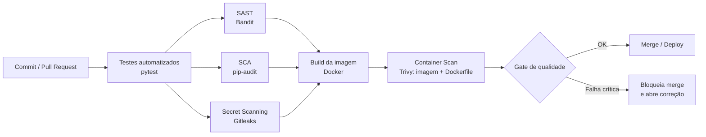

# Pipeline DevSecOps Integrado — Sprint 3 (Ford Challenge)

Este documento é a entrega separada exigida pelo Passo 3.0 do Sprint 3 (Cybersecurity):
demonstração de como o pipeline DevSecOps foi incorporado ao ciclo de desenvolvimento.

## Diagrama do pipeline



O workflow real está em `.github/workflows/devsecops-pipeline.yml` e roda a cada
`push`/`pull request` para `main` e `develop`.

## O que cada etapa faz e por quê

| Etapa | Ferramenta | O que detecta | Evidência gerada |
|---|---|---|---|
| Testes automatizados | pytest | Regressão funcional antes de qualquer gate de segurança | Log de execução (19 casos, ver `tests/`) |
| SAST | Bandit | Padrões de código inseguro (injeção, uso de `eval`, hardcoded secrets, etc.) no próprio código Python | `bandit-report.json` (artifact do job) |
| SCA | pip-audit | Vulnerabilidades conhecidas (CVE/PYSEC) nas dependências do `requirements.txt` | `pip-audit-report.json` (artifact do job) |
| Secret Scanning | Gitleaks | Segredos (chaves, senhas, tokens) commitados no histórico do repositório | Log do job `secret-scanning` |
| Container Scanning | Trivy | Vulnerabilidades no SO/pacotes da imagem Docker e más práticas no `Dockerfile` (roda como root, sem HEALTHCHECK, etc.) | Log do job `container-scan` |

## Execução local (para captura de prints antes de subir ao repositório)

```bash
pip install bandit pip-audit
bandit -r app -ll
pip-audit -r requirements.txt

# Requer Docker instalado
docker build -t sprint3-soa-cyber:local .
trivy image sprint3-soa-cyber:local
trivy config Dockerfile
```

## Resultado da primeira execução (evidência técnica)

- **SAST (Bandit):** 0 problemas de severidade média/alta em ~2.500 linhas de código
  Python analisadas. 1 falso positivo de baixa severidade (`B105`, string literal
  `"bearer"` interpretada como possível senha hardcoded — não é um segredo).
- **SCA (pip-audit):** identificou dependências desatualizadas com CVEs conhecidas
  (`requests`, `python-multipart`, `python-dotenv`, `cryptography`, `pytest`). Ação
  tomada: `requirements.txt` foi atualizado para as versões corrigidas e a
  dependência `python-jose` foi **removida** por estar sem uso no código (o projeto
  usa `PyJWT`) e trazer a dependência transitiva vulnerável `ecdsa`.
- **Secret Scanning:** identificado um segredo real no arquivo `.env` incluído no
  pacote entregue (`DB_PASSWORD`, `SECRET_KEY`, `PAYLOAD_SECRET_HMAC`,
  `DATA_ENCRYPTION_KEY`). Isso **não** deveria ter sido entregue/commitado.
  Ação corretiva obrigatória: rotacionar todas essas credenciais e nunca
  incluir `.env` fora do `.gitignore` em pacotes entregues (ver `docs/COMPLIANCE_CHECKLIST.md`).
- **Container Scanning:** ainda não havia `Dockerfile`; foi criado com usuário
  não-root, imagem `slim`, `HEALTHCHECK` e sem segredos embutidos.

## Rastreabilidade (registro de execução como parte da entrega)

Ao rodar o pipeline no GitHub Actions, tire prints de:
1. Lista dos 5 jobs concluídos (aba *Actions* do repositório).
2. Artefato `sast-bandit-report` e `sca-pip-audit-report` baixados.
3. Log do job `secret-scanning` (mesmo que "no leaks found" após a correção).
4. Log do job `container-scan` com o resumo de vulnerabilidades do Trivy.

Anexe essas capturas de tela ao documento final de entrega do Sprint 3.
